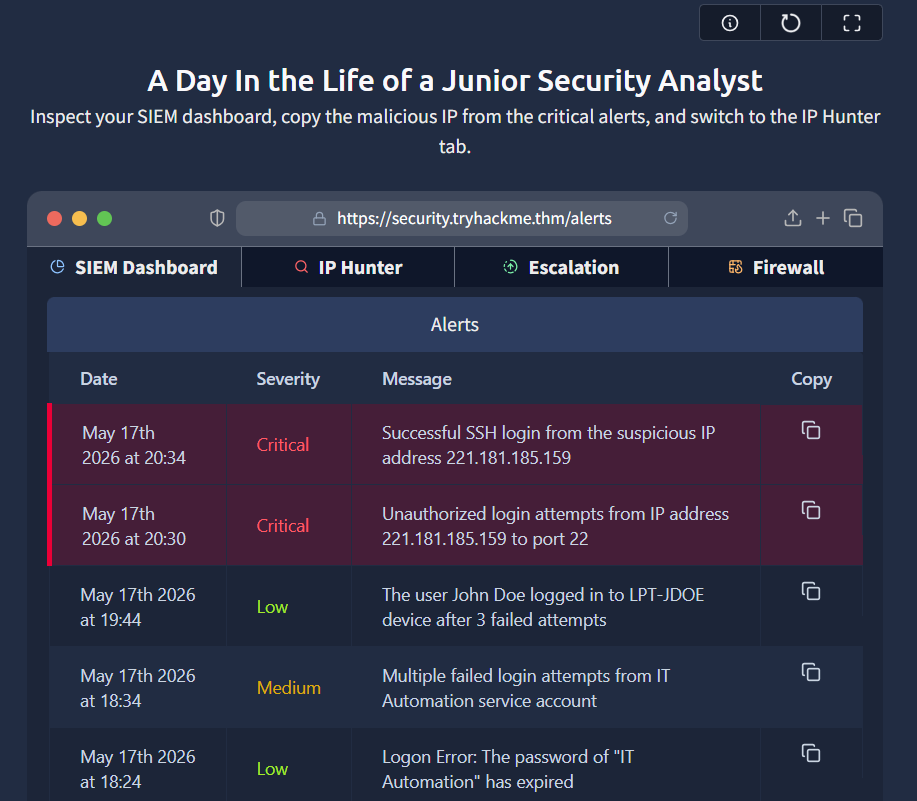
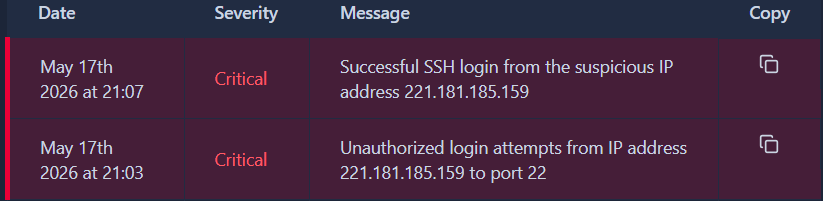
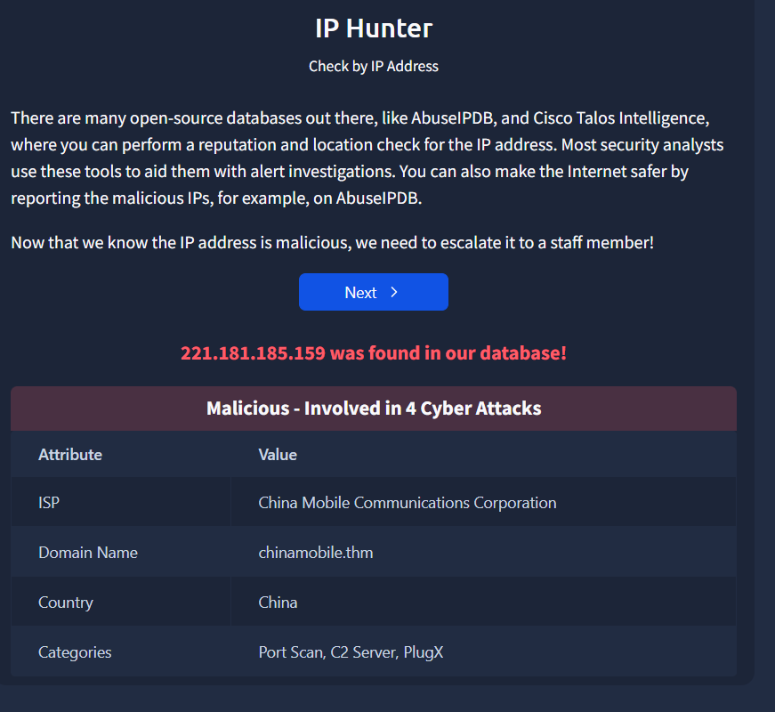
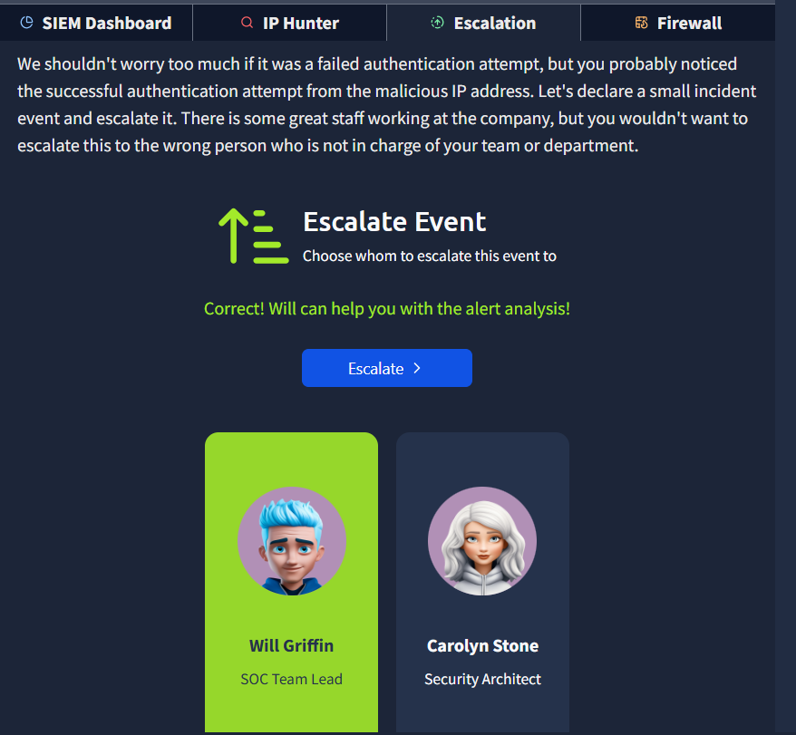
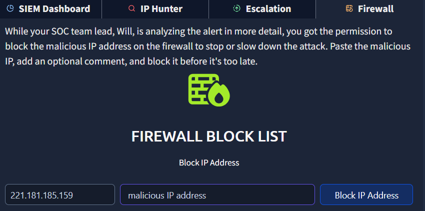

# Junior SOC Alert Investigation

## Overview

This project documents a SOC investigation where I analyzed SIEM alerts, identified a malicious IP address, validated the threat, escalated the alert, blocked the IP address on the firewall, and verified the remediation.

---

## Skills Demonstrated

- SIEM Monitoring
- Alert Investigation
- Threat Detection
- Incident Escalation
- Firewall Remediation
- Incident Verification

---

## Tools Used

- SIEM Dashboard
- Firewall Console
- IP Reputation Scanner

---

# Investigation Process

## Step 1 — Reviewed SIEM Alerts

I inspected the SIEM dashboard to identify suspicious activity and alerts.

---

## Step 2 — Identified the Malicious IP Address

I reviewed the alert details and identified the malicious IP address associated with suspicious activity.

---

## Step 3 — Scanned the IP Address

I scanned the IP address to determine whether it was malicious and confirmed suspicious activity.

---

## Step 4 — Escalated the Incident

After validating the threat, I escalated the alert to Will Griffin according to SOC procedures.

---

## Step 5 — Blocked the IP Address

The malicious IP address was blocked on the firewall to prevent further communication.

---

## Step 6 — Verified the Remediation

I rescanned the IP address after the firewall action and received a confirmation message showing the IP was successfully blocked.

---

# Lessons Learned

Through this project, I learned:
- How SOC analysts investigate alerts
- How to identify malicious IP addresses
- How to validate threats
- How escalation procedures work
- How firewall remediation is verified

---

# Conclusion

This project demonstrates a basic SOC analyst workflow from detection to remediation and verification.
